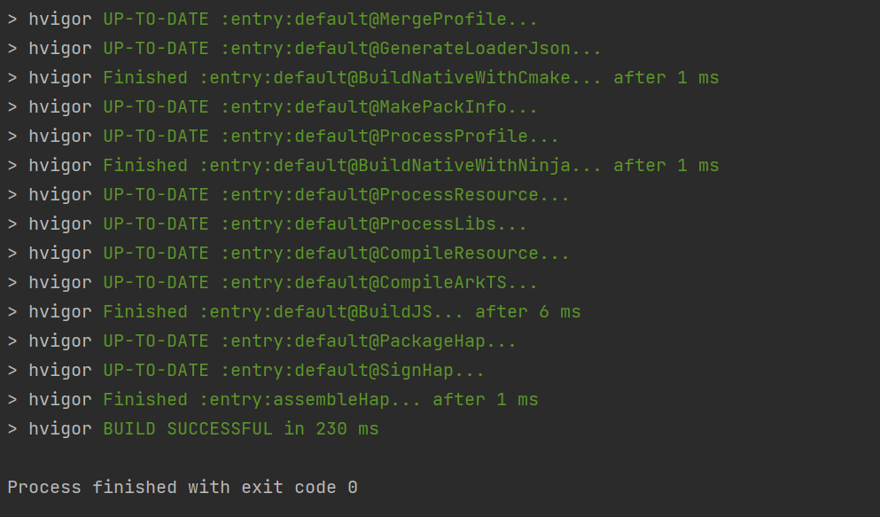

[image_0]: https://pfst.cf2.poecdn.net/base/image/5af70ff57cf24e2e44b85ac01a58293fb3db1eca78d9649b855eb5b6f70a04ea?w=738&h=1280&pmaid=67548867
# Helloworld-demo

This is an app built using DevEco Studio.

To download the code, run the following command:
```
git clone https://github.com/openharmony-research/helloworld-demo.git
```

Open the project in DevEco Studio. Then, build the HAP file. If you build successfully, you will see:


After a successful build, upload the `entry-default-signed.hap` file to the server using commands like `scp`.

To start an OpenHarmony device using QEMU, connect to the device using the following command:
```
hdc tconn 192.168.137.2:5555
```

To install the app, use the following command:
```
hdc -t <ip> install xxx.hap
```

To launch the HelloWorld program, use the command:
```
# aa start -a EntryAbility -b com.example.helloworld
```

You will see the following screen:


To exit the program, use the command:
```
aa force-stop com.example.helloworld
```
